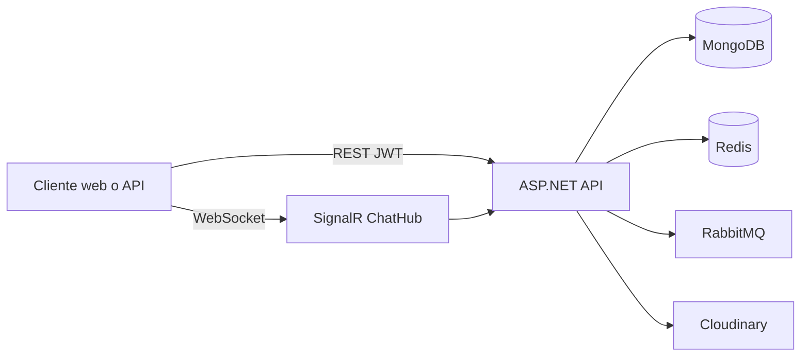

# Uni Chat Backend

API de chat en tiempo real con **ASP.NET Core 10**: JWT, MongoDB, Redis, RabbitMQ, SignalR y Cloudinary.

## Para quién es cada guía

| Perfil | Empieza aquí |
|--------|----------------|
| Desarrollador nuevo en el repo | [Instalación]({{ site.baseurl }}/instalacion.html) |
| Integración con la API o SignalR | [Backend]({{ site.baseurl }}/backend.html) |
| Visión del producto, arquitectura y E2EE | [Chat privado / E2E]({{ site.baseurl }}/chat-privado/) |
| CI, imagen Docker y calidad | [CI/CD]({{ site.baseurl }}/cicd.html) |
| Deploy y secrets en GitHub | [CI/CD y secrets]({{ site.baseurl }}/github-secrets.html) |
| Mantener este sitio | [Editar documentación]({{ site.baseurl }}/contribuir-docs.html) |

## Arquitectura en una vista



## Guías principales

| Guía | Descripción |
|------|-------------|
| [Instalación]({{ site.baseurl }}/instalacion.html) | Paso a paso: clonar, Docker, `.env`, `make run` |
| [Backend]({{ site.baseurl }}/backend.html) | Estructura del código, endpoints, SignalR, Scalar |
| [Chat privado / E2E]({{ site.baseurl }}/chat-privado/) | Arquitectura, componentes y cifrado |
| [CI/CD]({{ site.baseurl }}/cicd.html) | GitHub Actions y GHCR |
| [CI/CD y secrets]({{ site.baseurl }}/github-secrets.html) | Variables de producción y `render-env.sh` |

## Inicio rápido

Desde la carpeta del proyecto .NET (`uni-chat-backend/uni-chat-backend/`):

```bash
git clone https://github.com/DaR3kDev/uni-chat-backend.git
cd uni-chat-backend/uni-chat-backend
cp .env.ci.example .env
make up && make run
```

API local: **http://localhost:5012**

Documentación interactiva (con la API en `Development`): **http://localhost:5012/scalar/v1**

Repositorio: [github.com/DaR3kDev/uni-chat-backend](https://github.com/DaR3kDev/uni-chat-backend)
